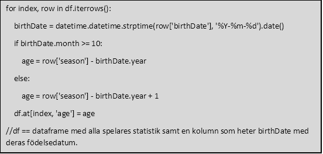
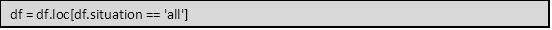
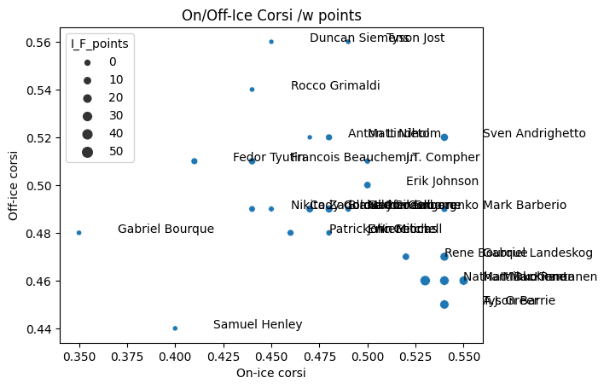
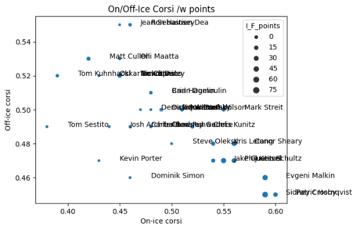
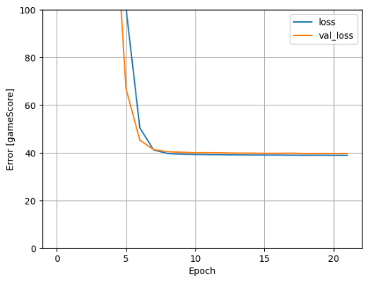
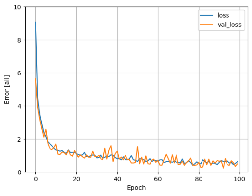
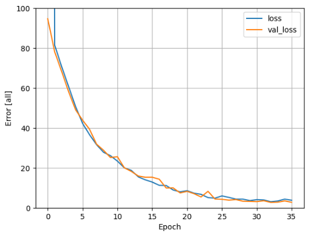

# Predicting point production for NHL players with deep learning

This was my final project for the course Deep Learning at Umeå University during the Spring of 2024. The paper below is in Swedish, but I've also uploaded the notebook that I ran on Kaggle.com. 

# Prediktera poängproduktion för NHL-spelare
## Introduktion
Nordamerikanska National Hockey League omsatte 6,43 miljarder dollar säsongen 2022-23. Det är Nordamerikas fjärde största sport efter omsättning efter National Football League (NFL), Major League Baseball (MLB) och National Basketball Association (NBA).  (Gough, 2024)

Idag har samtliga klubbar i NHL renodlade analytiker anställda som lägger all sin tid på att studera både sina egna spelare, men också motståndare och prospekt utomlands. De tar hänsyn till hundratals datapunkter med allt från tacklingar, tekningar, skottvinkel, avstånd till målet vid avslut till hur stor skillnad en spelare gör om den är av eller på isen när motståndarna har pucken i egen zon. Det finns ett mått på allt numera. 

NHL använder sig av ett lönetak som varje klubb måste hålla sig under, men också ett lönegolv som alla klubbar måste hålla sig över. Det innebär att poäng per spenderad krona blir ett viktigt mått. Ishockey har relativt stora trupper där NHL-lag tillåts att ha 50 spelare under kontrakt, men den aktiva truppen som spelar i NHL får vara max 24 spelare. Att hitta ”guldkorn” som presterar över sin lönenivå blir därför en sport inom sporten. 

Det finns flertalet etablerade hemsidor som publicerar data baserat på deras egna observationer av tusentals matcher och händelser i dem. Moneypuck.com är en av dem. Den skapades av Peter Tanner som bland annat har ett förflutet vid Lunds universitet, men jobbade också för Obama under hans presidentkampanj 2012, och är idag Director of Data science vid CapitalOne.

Moneypuck publicerar all sin grunddata i form av kommaseparerade filer fritt på hemsidan. Den har 150 numeriska parametrar utöver saker som namn, lag, spelform och andra saker som uttrycks bättre i text. Deras ambition är att använda datan för att prediktera utgången i matcher, men de har även gjort lite mer fantasifulla prediktioner som vilken huvudtränare som är nästa att få sparken. (Tanner, 2014)

Syftet är att ta denna data, städa och transformera den för att kunna träna ett artificiellt neuronnätverk med den för att kunna prediktera poängproduktion för individuella spelare. Det kommer att göras jämförelse mellan en enkel regressionsmodell och ett mer avancerat artificiellt neuronnätverk.

Datakälla
Länk 1: <https://moneypuck.com/data.htm>
Länk 2: <https://peter-tanner.com/moneypuck/downloads/MoneyPuckDataDictionaryForPlayers.csv>

En närmare beskrivning av alla olika datapunkter finns att ladda ner via Länk 2 ovan. Den definierar 150 olika datapunkter som samlats in för alla spelare sedan NHL-säsongen 2008/09. Filerna innehåller även fyra kolumner identifierare för spelare och lagtillhörighet. Totalt innehåller en konkatenerad fil av alla tillgängliga säsonger 72 055 rader. 

Datan är uppdelad efter spelform, vilket innebär att varje spelare har för varje säsong fem rader med data: all, other, 4on5, 5on5, 5,on4. Vi kommer endast att arbeta med raderna med all, vilket göra att mycket av datan kommer att rensas bort då den även ingår i raderna benämnda ”all”. 

Vi kommer även att ta bort rader för målvakter och spelare som spelat mindre än 20 matcher. De senare anses inte vara en reguljär NHL-spelare och är därmed inte relevant för detta projekt. 
## Metod
### Förbehandling
Data för ”skaters” laddas ner från datakällan ovan för samtliga tillgängliga säsonger. Data analyseras för att verifiera att den är komplett och inte innehåller några saknade värden. Alla säsonger konkateneras sedan till en enda stor fil. 

Moneypuck.com tillhandahåller även en datafil med all spelarinformation. Denna fil innehåller dock en del tomma fält. Dessa fält kompletterades med data från eliteprospects.com som artikelförfattaren bedömer som den mest uppdaterade och trovärdiga källan för spelarinformation generellt sett. 

Dessa två filer slås sedan ihop baserat på filernas interna spelar-id. Detta för att komplettera statistikraderna med information om spelarens ålder vid den typiska säsongen. För att göra detta matchas spelarens födelsedatum in på varje rad och detta räknas sedan om med hjälp av en funktion till en ålder baserat på vilken säsong det var och om de fyller år före eller efter första oktober varje år. Det är ungefär då säsongen startar. 

**Diagram 1.** Funktion för att räkna ut ålder från födelsedatum och säsong (i Python)

for index, row in df.iterrows():

`    `birthDate = datetime.datetime.strptime(row['birthDate'], '%Y-%m-%d').date()

`    `if birthDate.month >= 10:

`        `age = row['season'] - birthDate.year

`    `else:

`        `age = row['season'] - birthDate.year + 1

`    `df.at[index, 'age'] = age

//df == dataframe med alla spelares statistik samt en kolumn som heter birthDate med deras födelsedatum. 

Ur filen utesluts sedan alla målvakter och alla situationer som är delmoment och i stället sparas endast.

df = df.loc[df.situation == 'all']

**Diagram 2.** Exempel på kod som väljer ut bara rader med alla situationer med hjälp av pandas

En grafisk analys av datan görs med Colorado Avalanche säsongen 2016/17 där vi plottar Corsi-on-ice vs Corsi-off-ice med poängproduktion (I\_F\_points) som storlek på punkten. Det var en rätt horribel säsong för dem och därav av lite mer intressant än ett slumpmässigt valt lag. Det görs sedan en jämförelse med Pittsburgh Penguins som vann Stanley Cup denna säsong. 

Datan rensas sedan ytterligare från kolumnerna som bara innehåller textinformation eller id-nummer.

I och med att anfallare och backar har relativt olika roller på isen och eftersom ett lag innehåller fler anfallare än backar fördelar sig också speltiden väldigt olika. Därför delas filen upp i två filer för backar och anfallare. För att enkelt kunna växla mellan dataseten sätts en flagga där man enkelt kan växla mellan de två dataseten. 

Dessa delas sedan upp i tränings och testdata, normaliseras och kolumnen I\_F\_points sätts som målet för våra prediktioner.

Dessa moment utförs till största del med hjälp av Python-biblioteketen numpy, Pandas, matplotlib, seaborn och egenskriven Python-kod enligt diagram 1. Inspiration har tagits ifrån TensorFlow:s dokumentation och Alexander Gambino:s notebook på Kaggle baserat på deras inbyggda NHL-data. (TensorFlow, 2024) (Gambino, 2021)
### Träning av djuplager
#### *Förlustfunktion*
Eftersom vi söker en regressionsmodell väljer jag att hålla mig till mean squared error och absolute mean error för att utvärdera modellerna. Vi söker minsta möjliga fel vid vår prediktion av ett numeriskt värde. Jag övervägde att använda Huber, men valde bort det då jag inte hunnit bekanta mig med den ordentligt. 

Vi försöker inte gruppera, prediktera några klasser eller identifiera objekt av något slag, vilket skulle motiverat att kolla på andra typer av förlustfunktioner. 
#### *Enkel regressionsmodell*
Tanken är sedan att göra två väldigt enkla tester med simpel regression med hjälp av ett djuplager med en kärna där vi försöker prediktera värdet för I\_F\_points. Prediktion kommer att ske med hjälp av en parameter, gameScore, och med alla parametrar. 

Early stopping nyttjades inte vid tester med simpel regression. 
#### *Djuplärningsmodeller*
##### Baslinjemodell
Först designas en enkel modell med 32 kärnor i ett djuplager och detta testa både med att prediktera på endast gameScore och med alla parametrar. 
##### Keras tuner
Efter det nyttjades automatiken i Keras tuner. En basmodell definierades som kunde variera med följande inställningar:

Antal djuplager: 1-3
Kärnor per djuplager: 32 – 256
Batch-storlek: 32 – 512
Inlärningstakt: 0,01, 0,001

Keras tuner hade inställningar enligt nedan. I och med att träningen gick snabbt gick det bra att vara generös med antal försök och körning per försök. Antal epocher ställdes också högt i och med att det ändå nyttjades tidigt stopp. 

Antal försök: 30
Körningar per försök: 3
Antal epocher: 250

Tidigt stopp hade följande inställningar:
Tålamod: 5
Mätvärde: val\_loss

Kod för att köra Keras Tuner togs från laboration 1 och modifierades för att kunna ta emot träningsdatan och målprediktionen. Funktionen compile\_and\_fit från Laboration 3 användes med mindre modifieringar för att kunna ta emot även träningsdatan och målprediktionen.
## Resultat
### Grafisk analys
För att undersöka datan gjordes två diagram från säsongen 2016 med Colorado Avalanche och Pittsburgh Penguins. Avalanche var ett av NHL:s sämsta lag denna säsong medan Penguins tog hem Stanley Cup.

Y-axeln sätts till off-ice corsi, X-axeln sätts till on-ice corsi och storleken på datapunkten till I\_F\_points, vilket motsvarar spelarens poängproduktion. 

Corsi är ett värde för skottfördelning mellan lagen. 50% innebär att lika många skott avlossas mot respektive mål. 

**Diagram 3.** Colorado Avalanche, säsong 2016/17 

I just denna graf är det inte speciellt många spelare som faller inom off-ice corsi < 0,5 och on-ice corsi > 0,5, vilket är rimligt med ett så pass dåligt lag. 

Vi ser att Tyson Barrie, Nathan MacKinnon, Mikko Rantanen och Gabriel Landeskog alla ligger i nedre högra hörnet, vilket var väntat. Gabriel Borque , Tyson Jost och Duncan Siemens gjorde sig bäst på bänken, medan Samuel Henley i sin tur är ett unikt fall av att ha negativ effekt både på och av isen. 

**Diagram 4.** Pittsburgh Penguins, säsongen 2016/17

Här ser vi hur en av tidens mest underskattade spelare placerar sig allra längst ner i högra hörnet, Patric Hörnqvist. Vi ser också Skellefteå AIK-bekantingen Tom Kuhnhackl som var en av lagets minst betydelsefulla spelare, men i Skellefteå AIK var han en mycket uppskattad spelare.

Hörnqvist har fint sällskap av Evgeni Malkin och Sidney Crosby, men framför allt ser vi ett moln av spelares som är till höger om 0,50, vilket stämmer väl in med att detta ska vara ett bra lag. 
### Enkel regressionsmodell
#### *Prediktion från gamescore*
Den första baslinjemodellen som togs fram hade ett djuplager med en kärna och testades först med att endast ta gamescore som invärde. 
**

**Diagram 5.** Förlustgraf för prediktion av I\_F\_points från gamescore. 

När vi utvärderar modellen mot testsetet genererar den en noggrannhet på 4,520 och förlust på 35,5369. 
#### *Prediktion från alla invärden*
**Diagram 6.** Förlustgraf för prediktion av I\_F\_points från alla 149 invärden.

När modellen utvärderades landade noggrannheten på 0,842 och förlusten på 1,2969.

### Djuplärning med ett lager med 32 kärnor
#### *Prediktion från gamescore*

**Diagram 7.** Förlustgraf för prediktion av I\_F\_points från gamescore med 32 kärnor i dolt lager

Testnoggrannheten landade på 4,528 och förlusten på 35.4948. 
#### *Prediktion från alla invärden*
**Diagram 8.** Förlustgraf för prediktion av I\_F\_points från alla invärden med 32 kärnor i dolt lager.

Testnoggrannheten landade på 1,231 och testförlusten på 2,7288.
### Keras tuner
Keras tuner testades endast med samtliga värden att predikera mot. Att använda ett värde hade genererat samma platå om och om igen. 

**Tabell 1.** Resultat från tester med Keras Tuner

|**#**|**TEST LOSS**|**DENSE LAYERS**|**LEARNING RATE**|**BATCH SIZE**|**DENSE 1 UNITS**|
| :- | :-: | :-: | :-: | :-: | :-: |
|**1**|1\.001|1|0\.01|32|32|
|**2**|1\.111|1|0\.01|64|32|
|**3**|1\.144|1|0\.01|128|32|
|**4**|1\.139|1|0\.01|256|128|
|**5**|1\.185|1|0\.01|288|96|
|**6**|1\.193|1|0\.01|256|96|
|**7**|1\.110|1|0\.01|192|32|
|**8**|1\.173|1|0\.01|256|32|
|**9**|1\.227|1|0\.01|256|64|
|**10**|1\.089|1|0\.01|64|96|

Värt att poängtera att modellen kunde ha upp till tre lager och även använda sig av en inlärningstakt på 0.001, men inget av detta förekommer bland de tio bästa modellerna. 

## Diskussion
### Jämförelse mellan enkel regression och modell med djuplager

Graferna för den enkla regressionen och när vi introducerade ett dolt djuplager med 32 kärnor är skrämmande lika för när vi försökte prediktera enbart på gamescore. Detta beror troligen på en begränsning i datan vi matar in. Med endast ett invärde landar modellen snabbt på en platå och djuplagret gör ingen skillnad. Det finns för lite att jobba med. 

Prediktionen med samtliga invärden nådde en lägre förlust med den enkla regressionsmodellen än modellen med ett djuplager. Djuplagermodellen stannade sin träning efter 35 epoker och då låg förlusten under 5 medan regressionsmodellen nådde strax över 1 efter 20 epoker och fortsatte sakta nedåt fram till 100 epoker som var maxvärdet. 

Kurvan ser ut att ha plattats ut mellan 80-100 epoker, men ett lokalt minimum hade nog hittat tidigare än så om vi nyttjat ”early stopping” och en relativt låg tröskel om 3-5 epoker. 

Platån som vi såg med den enstaka värdet, gamescore, kom inte när vi körde alla invärden och vi fick en mer normal träningskurva. Även fel och noggrannhet blev mer normala, även om de fortfarande är långt ifrån speciellt bra. 

### Keras tuner

Tabell 1 visar tydligt att de lägsta förlustvärden kom fram genom endast 1 lager trots att upp till tre var möjligt och inlärningstakten 0.01 användes av alla modeller som i listan. Det verkar även som att färre antal kärnor i lagret var gynnsamt för prediktionen. Man skulle möjligen kunna argumentera för att en mindre batch-size också är att föredra. Den verkar korrelera med en högre testförlust. 

Model 4 är undantaget som har en större batch-size och 128 kärnor, medan hälften av modeller bland de tio bästa har endast 32 kärnor. 

Anledningen till att färre är bättre beror troligen på den lilla datamängden som vi tränar på samtidigt som problemet egentligen inte är överdrivet komplext. Vi vill försöka se trender och göra regressioner baserat på många parametrar per rad.

### Avslutande ord

Och om jag ska på något vis sammanfatta detta så är det nog med hjälp av uttrycket förkortat KISS, Keep It Simple, Stupid. Enkel regression löser detta problem snabbare och bättre. När det inte finns mer data än det gör blir ett stort neuronnätverk rent av sämre på alla tänkbara sätt. Det tar längre tid att räkna, krångligare kod, kräver mer prestanda och kostar mer att räkna ut. 

Det var ett kul försök, men för denna typ av prediktion tjänar man på att hålla det relativt enkelt. Jag hade nog behövt mycket, mycket mer data för att göra detta, men då ska man också hålla i bakhuvudet att den ishockey spelas idag är inte densamma som spelades för 20, 30, 40, 50 år sedan. 

Hur relevant är den datan för dagens ishockeyspelare? Reglerna har ändrats och spelarna är bättre tränade än någonsin. Sen sent som på 1980-talet var det inte ovanligt att spelare tog en cigarett i pauserna. Det är helt otänkbart idag där spelarna tvingas vara renlighetsmänniskor närmast för att de ska kunna leva upp till sin fulla potential. 

Det man troligtvis hade haft större framgångar med vore att försöka förutsäga vinst eller förlust genom att kombinera spelardatan med historiska matchresultat, men då är vi inne på sportsbetting och det vill jag hålla mig borta ifrån. Det skulle kunna vara intressant att försöka vända på det dock försöka se betydelsen en spelare har för att ett lag ska vinna en match. Det finns en parameter kallad WAR (Wins Above Replacement) som används för detta. De som tagit fram modeller för det har dock oftast inte delat med sig av hur de tagit fram dessa. (Solberg, 2019)

# Referenser

Gambino, A. (2021). *NHL Skater Metrics - EDA and Projections*. Hämtat från Kaggle: https://www.kaggle.com/code/alexgambino/nhl-skater-metrics-eda-and-projections/notebook

Gough, C. (den 23 04 2024). *National Hockey League - total league revenue from 2005/06 to 2022/23*. Hämtat från statista: https://www.statista.com/statistics/193468/total-league-revenue-of-the-nhl-since-2006/

Solberg, L. (den 16 01 2019). *Wins Above Replacement: History, Philosophy, and Objectives (Part 1)*. Hämtat från Hockey-Graphs.com: https://hockey-graphs.com/2019/01/16/wins-above-replacement-history-philosophy-and-objectives-part-1/

Tanner, P. (den 02 06 2014). *What Predicts Whether an NHL Coach Will Be Fired, And Whether It Matters*. Hämtat från FiveThirtyEight: https://fivethirtyeight.com/features/what-predicts-if-an-nhl-coach-will-be-fired-and-whether-it-matters/

TensorFlow. (den 23 03 2024). *Basic regression: Predict fuel efficiency* . Hämtat från TensorFlow: https://www.tensorflow.org/tutorials/keras/regression
